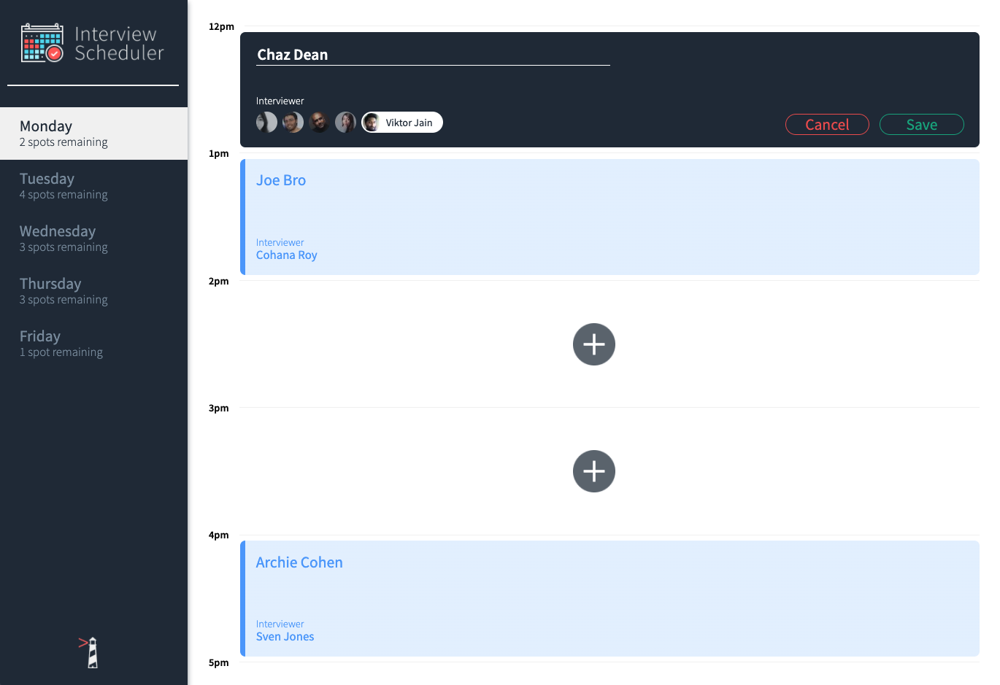

# Interview Scheduler

A single page web app that allows students to book time with interviewers in one of 5 hourly blocks from 12pm to 5pm, Monday to Friday.

## Screenshots





## Setup

Install dependencies with `npm install`.

## Running Webpack Development Server

```sh
npm start
```

## Running Jest Test Framework

```sh
npm test
```

## Running Storybook Visual Testbed

```sh
npm run storybook
```

